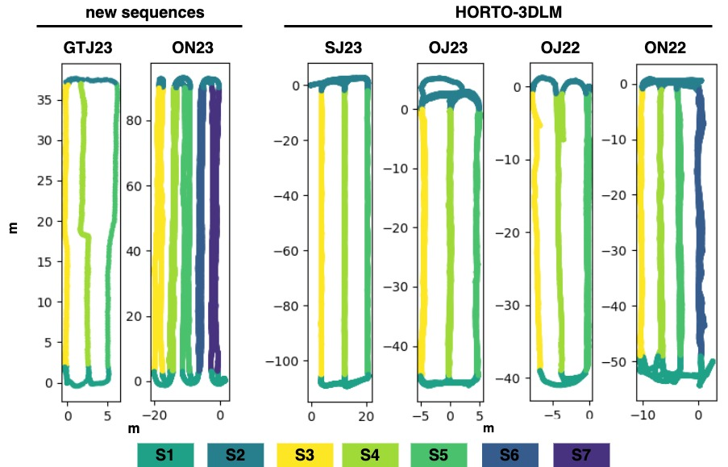
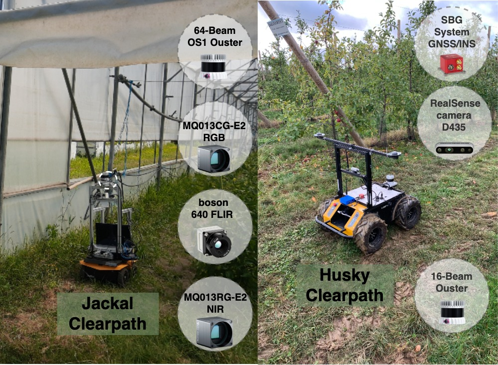
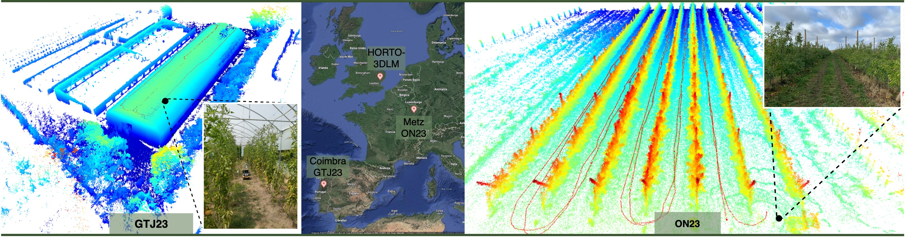
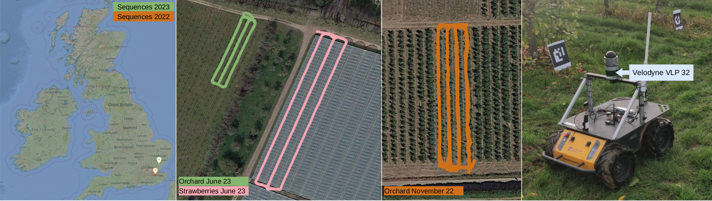

# HORTO-3DLM Dataset
The HORTO-3DLM Dataset contains 3D LiDAR and GNSS/localization data for the purpose of 3D LiDAR-based place recognition, localization and mapping in horticultural environments.

## [Download Place Recognition Dataset](https://nas-greenbotics.isr.uc.pt/drive/d/s/xlBvECKhyOdCECr8ybsjCbo5VSv8Y2Qe/kDgkBK8she3fivIYC9GtYmCEjnocr250-4btgX1UkOgs) | 

## [Download ROSBAGS](https://nas-greenbotics.isr.uc.pt/drive/d/s/xlBvECKhyOdCECr8ybsjCbo5VSv8Y2Qe/kDgkBK8she3fivIYC9GtYmCEjnocr250-4btgX1UkOgs) | 

## Content
1. [Updates](#1-updates)
2. [Dataset](#2-dataset)
3. [Citation](#3-citation)

## 1. Updates 
- **25/02/2024** HORTO-3DLM v2.0 added GTJ34 and ON22 sequences
- **1/12/2024** HORTO-3DLM v1.0 Uploaded


## 2. Dataset

***Table Caption: Summary of all sequences***

The ***Seq.*** column contains the sequence names. The ***M***, ***Y***, and ***C*** columns refer to the month, year, and country of recording, respectively. The total distance (***Dist***) of each sequence is measured in meters, while the scan size refers to the number of points in each scan.


| Seq.  | M    | Y    | C  | Nº Scans | Nº Rows | Dist. [m] | Scan Size | Plantation Type       |   ROSBags  |
|-------|------|------|----|----------|---------|-----------|-----------|-----------------------|------------|
| ON22  | Nov. | 2022 | UK | 7974     | 4       | 514       | 48k       | Apple (open)          | [Download Link](https://nas-greenbotics.isr.uc.pt/drive/d/s/x4fX40E778VYIKB5vAl3ZdQmtM0zcl4i/ejhgJk-mZTt5Gd1OizUclrr7uUj26JQI-erBAEPREvAs)
| OJ22  | July | 2022 | UK | 4361     | 3       | 206       | 50k       | Apple (open)          | [Download Link](https://nas-greenbotics.isr.uc.pt/drive/d/s/x4fWxJWA4EsiV9MxxavZtpvTOBsEqxi8/EOv3MCribsceUr7y0uesc8NcrCPEzdF7-ibBgGzNFvAs)
| OJ23  | June | 2023 | UK | 7229     | 3       | 459       | 46k       | Cherry (open)         | [Download Link](https://nas-greenbotics.isr.uc.pt/drive/d/s/x4fX1lqfCUdk0UzbIeXMYNkdiyScooxz/ToAVnL93qFX6hADup6IIiiFwovjcOiS3-mrAgsGhFvAs) |
| SJ23  | June | 2023 | UK | 6389     | 3       | 742       | 48k       | Strawberry (polytunnels) |  [Download Link](https://nas-greenbotics.isr.uc.pt/drive/d/s/x4fWufaoRocE1qnuIT9jpIuW9ocKD5mY/MR0wlhXUeQQgwSpvsB47mlTgXruKouHV-qbAgF4tFvAs) |
| ON23  | Nov. | 2023 | FR | 3086     | 5       | 966       | 105k      | Apple (open)          |  [Download Link](https://nas-greenbotics.isr.uc.pt/drive/d/s/x4h45cHubOv5pIGf1bqeQuLuKzXV583q/HyrVas7MX7XxBQ81Ch6xkCNGS-eZBrek-xbDghrxFvAs) |
| GTJ23 | June | 2023 | PT | 661      | 3       | 202       | 60k       | Tomato (greenhouse)   | [Download Link](https://nas-greenbotics.isr.uc.pt/drive/d/s/x4eZ82yjaMHLRWjHG21lLxUHtiLpIB0e/J57UdN7j4eL8MdDTFHBck0kEKq4RIulq-z7dATNQVbgs) |


### Trajectories with segment labels and recording setups

<p align="center">
  
   
</p>


***Sequence ON23*** was recorded in November 2023, in an orchard in Metz, France,  with an 16-beam Ouster 3D LiDAR and an SBG GNSS/INS system (without RTK) mounted on a Clearpath Husky mobile platform. To address the low LiDAR resolution, the original scans were merged to increase point density, resulting in sub-maps with approximately 100k points per sub-map. This operation reduced the original sequence from 25836 scans to 3086 sub-maps in total.

***Sequence GTJ23*** was recorded in June of 2023, in a tomato plantation within a greenhouse, in Coimbra, Portugal,  with a 64-beam Ouster 3D LiDAR mounted on a Clearpath Jackal mobile platform. Due to signal interference caused by the greenhouse structure, the GNSS signal was unreliable. Therefore, the ground-truth positions were computed using a SLAM approach.

 

### V1.0:
These sequences were recorded in England, UK, using a Clearpath Husky mobile robot equipped with a Velodyne VLP32 3D LiDAR (10Hz) and a ZED-F9P RTK-GPS (5Hz).

 

- OJ23: orchards,
- OJ22: orchards,
- SJ23: strawberries within polytunnels with a table-top growing system.
- ON22: orchards


### 3D Maps


## Structure

```
HORTO-3DLM
├── GT23 
├── OJ22
├── OJ23
├── ON22
├── ON23
└── SJ23
    └── extracted
        ├── eval
        |   └──ground_truth_loop_range_10m.pkl 
        ├── point_cloud
        |   ├── 0000000.bin
        |   ├── 0000001.bin
        |   ├── ...
        |   └── xxxxxxx.bin
        ├── triplet
        |   └── ground_truth_ar0.5m_nr10m_pr2m.pkl
        ├── extracted_info.txt
        ├── gps.txt
        ├── gps.kmz
        ├── gps_timestamp.txt
        ├── point_cloud_timestamp.txt
        ├── point_row_labels.pkl
        ├── positions.txt
        ├── positions_timestamp.txt
        ├── static_tf.txt
        ├── tf_poses.txt
        └── tf_poses_timestamp.txt

```

### Content:
 - **eval/ground_truth_loop_range_10m.pkl:** pickle file with the ground truth data for evaluation(testing), containing anchors/positives indices for 10m range loops.
 - **point_cloud/:** Folder with the point clouds.
 - **triplet/ground_truth_ar0.5m_nr10m_pr2m.pkl** pickle file with the ground truth data for training, containing anchors, positives and negatives. The 0.5m between anchors; the positives were selected from within a 2m range; and negatives were selected from outside a 10m range.  
- **extracted_info.txt:** some info from the extracted data;
- **gps.txt:** GNSS data in UTM reference system.
- **gps.kmz:** GNSS data for visualization on maps.
- **gps_timestamp.txt:** timestamps for GNSS data.
- **point_cloud_timestamp.txt:** timestamps for point cloud. row index 00 -> points cloud 00000.bin.
- **point_row_labels.pkl:** segment labels for each position data.    
- **positions.txt:** position data with (x,y,z), used in place recognition for ground truth.
- **positions_timestamp.txt:** timestamps for position data 
- **static_tf.txt:** static tf between base_link and LiDAR
- **tf_poses.txt:** pose data in the format of transformation matrix flattened to fit one file row.  
- **tf_poses_timestamp.txt:** timestamp of the tf_pose.txt data.

## Citation:
```
@article{barros2023orchnet,
    title={ORCHNet: A Robust Global Feature Aggregation approach for 3D LiDAR-based Place recognition in Orchards},
    author={Barros, T and Garrote, L and Conde, P and Coombes, MJ and Liu, C and Premebida, C and Nunes, UJ},
    journal={arXiv preprint arXiv:2303.00477},
    year={2023}
}
```


### TO-DO
- Add information
- Add Sensor TFs
- Add Dataset structure